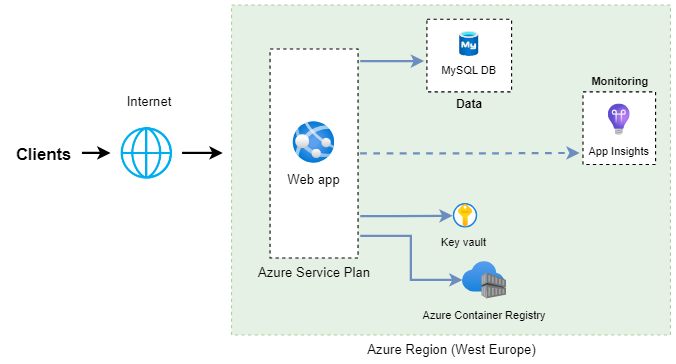
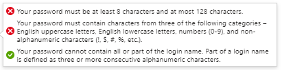

## Project  

This is a POC for deploying the Ghost blogging framework on Azure using Azure WebApp for Containers.  

This POC covers the infra-as-code pipeline for deploying the architecture using Bicep, and includes a simple integration pipeline to publish the image to a private registry which triggers the application deployment.  

We use the Ghost framwork image for this POC, this can help streamling the development process.

## Architecture

Below the architecture of the project

  

### Azure App Service  

Azure App service is a PAAS for hosting web services, it supports also hosting containers which will be used here.  

### Azure database for MySQL-Flexible server  

MySQL is the supported database by the Ghost framework, other databases are compatible and but they are not officially supported.  
Azure

### Azure Container Registry  

To enforce security, we are using a private registry for our images which is Azure Container Registry. It offers a seamless integration with Azure services.  
It supports automatically triggering a deployment once an image is published. This feature is enabled for this POC.

### Azure Application Insights  

In order to monitor our application and get insights about clients requests and performance we are using Application Insights, which provides real-time monitoring capabilities. It can be used for alerting purposes and also for constructing monitoring dashboards.  

### Key Vault  

The Key Vault is used here to store the database credentials.  

### Azure File Share  

The Ghost framework stores data in the database, but images and media are stored locally. To address this, an Azure file share can be mounted to the container. This won't be included in this POC.

## How to start the project  

This documentation explains how to run the application from scratch. To facilitate this process, we provide two workflows on Github actions:  

- IaC workflow to deploy the infrastructure using Bicep  
- CI workflow to publish the application
  
## Setup Github Action Workflow for IaC deployment

### 1) Service principal for deployment  

Login to Azure and create the SPN using the following command: 

` az ad sp create-for-rbac --name ghostci --role owner --scopes /subscriptions/{your_subscription-id} --json-auth `  

Copy the output for later use.

### 2) Add the spn credentials secret to Github Action workflow  

Add a secret named **AZURE_CREDENTIALS** to Github Action to store the SPN credentials.  

Detailed steps :  

```
    - In GitHub, navigate to your repository. 

    - Select Settings > Secrets and variables > Actions > New repository secret.

    - Paste the entire JSON output from the step 1 the secret's value field. Name the secret **AZURE_CREDENTIALS**. 
```

### 3) Add an Azure MySQL password in Github Action worklfow  

You will need to add a secret named **AZURE_MYSQL_PASSWORD** with a valid database password following the steps above.  
Requirements for password:  



### 4) Launch [Deploy Ghost infrastructure](https://github.com/ghostblog/actions/workflows/main.yml) workflow  

The workflow **Deploy Ghost infrastructure** can be triggered manually from Github Action. 

## Setup Github Action worklfow to deploy Ghost application  

We are using the ghost image as a base image for our custom deployement.  

### 1) Add a variable with the Azure Container Registry name & access key  

a) Retrieve the name of the ACR from the resource blad in Azure Portal. Name the variable **ACR_NAME** in Github action.

b) Add a secret named **ACR_ACCESS_KEY** with the access key value in Github Action. The access key is available on the ACR resource in Azure Portal in the Access Keys view.

### 2) Publish image [Docker Image Build & Push to ACR](https://github.com/ghostblog/actions/workflows/docker-image-build.yml) and access to the application   
  
This process will build and publish the image to ACR. The web app deployed before target this ghost image and would be able to pull the image once the process is finished.  

You can launch the website from the Azure portal by clicking on 'Browse' in the Web App blade. The first access to the website may take some time as the application is being initiated.  